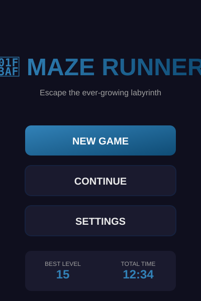
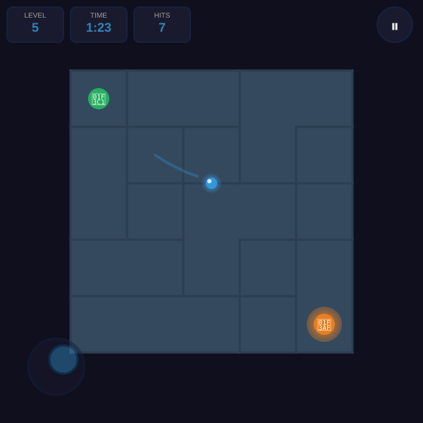
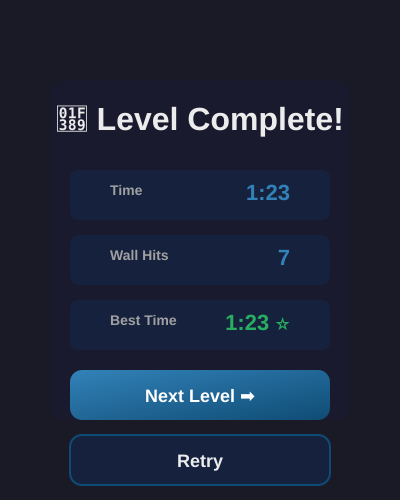
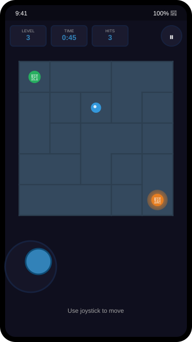

# 🎯 Maze Runner - Escape the Labyrinth

A challenging, progressive maze game built with vanilla TypeScript, Vite, and HTML5 Canvas. Navigate through randomly generated labyrinths that grow increasingly complex with each level.

## 📸 Screenshots

<div align="center">

### Main Menu


### Gameplay


### Level Complete


### Mobile Version


</div>

---

## 🎮 Features

### Core Gameplay
- **Random Maze Generation**: Every level features a unique, procedurally generated maze using DFS backtracking algorithm
- **Progressive Difficulty**: Mazes grow larger and more complex as you advance through levels
- **Smooth Physics**: Realistic collision detection with wall sliding and friction
- **Performance Optimized**: 60 FPS on mobile devices with offscreen canvas buffering

### Controls
- **Desktop**:
  - Mouse: Click and drag or hover to follow
  - Keyboard: WASD or Arrow keys
- **Mobile**:
  - Virtual joystick (touch)
  - Drag to move
  - Automatic control mode detection

### Features
- ✅ **Cross-platform**: Works on desktop and mobile browsers
- ✅ **Adaptive UI**: Responsive design from 360x640 to desktop
- ✅ **Progress Saving**: LocalStorage-based progression system
- ✅ **Sound & Haptics**: Optional audio feedback and vibration
- ✅ **Debug Mode**: Performance overlay with FPS, seed, and collision stats
- ✅ **HiDPI Support**: Crisp rendering on Retina displays

## 🚀 Quick Start

### Installation

```bash
# Install dependencies
npm install

# Start development server
npm run dev

# Build for production
npm run build

# Preview production build
npm run preview
```

### Testing

```bash
# Run tests
npm test

# Run tests with UI
npm test:ui
```

## 🎯 How to Play

### Objective
Navigate your ball from the **green start marker** (🏁) to the **orange finish marker** (🎯) without hitting too many walls.

### Scoring
- **Time**: Complete levels as fast as possible
- **Wall Hits**: Minimize collisions for a better score
- **Best Time**: Your personal record is saved for each level

### Controls Guide

**Desktop (Mouse)**:
- Click near your ball to make it follow your cursor
- The ball will stop when it reaches your pointer

**Desktop (Keyboard)**:
- `W` / `↑` - Move up
- `S` / `↓` - Move down
- `A` / `←` - Move left
- `D` / `→` - Move right

**Mobile (Joystick)**:
- Use the virtual joystick in the bottom-left corner
- Drag the stick in the direction you want to move
- Release to stop

**During Game**:
- `Pause Button` - Pause the game
- `ESC` - Pause (keyboard)

## 🏗️ Architecture

### Project Structure

```
maze-runner/
├── src/
│   ├── main.ts              # Entry point
│   ├── types.ts             # TypeScript interfaces
│   ├── config.ts            # Game configuration
│   ├── utils/
│   │   ├── random.ts        # Seedable RNG (Mulberry32)
│   │   └── storage.ts       # LocalStorage wrapper
│   ├── maze/
│   │   ├── generator.ts     # DFS maze generation
│   │   └── validator.ts     # Path validation (BFS)
│   ├── game/
│   │   ├── state.ts         # Game state management
│   │   ├── engine.ts        # Main game loop
│   │   ├── player.ts        # Player physics
│   │   ├── collision.ts     # Collision detection
│   │   └── input.ts         # Input handling (pointer/keyboard)
│   ├── render/
│   │   ├── canvas.ts        # HiDPI canvas setup
│   │   ├── maze-renderer.ts # Offscreen maze rendering
│   │   └── game-renderer.ts # Game rendering
│   ├── ui/
│   │   └── ui-manager.ts    # UI state and events
│   ├── audio/
│   │   └── sounds.ts        # Web Audio API sounds
│   └── debug/
│       └── overlay.ts       # Debug overlay
├── tests/
│   ├── maze.test.ts         # Maze generation tests
│   └── collision.test.ts    # Collision tests
├── index.html               # Main HTML
├── styles.css               # Global styles
└── package.json
```

### Key Technologies

- **TypeScript**: Type-safe code
- **Vite**: Fast build tool and dev server
- **Canvas API**: Hardware-accelerated rendering
- **Web Audio API**: Procedural sound generation
- **Pointer Events**: Unified mouse/touch handling
- **LocalStorage**: Persistent game state
- **Vitest**: Unit testing framework

### Algorithms

#### Maze Generation (DFS Backtracker)
1. Create grid with all walls intact
2. Start from random cell, mark as visited
3. Randomly choose unvisited neighbor
4. Remove wall between current and chosen cell
5. Move to chosen cell and repeat
6. Backtrack when no unvisited neighbors
7. Add complexity loops for higher levels

#### Collision Detection
- **Line-Circle Intersection**: Check player circle against wall segments
- **AABB Clamping**: Keep player within maze bounds
- **Sliding Physics**: Project movement along walls when collision detected

#### Pathfinding Validation (BFS)
- Breadth-first search from start to finish
- Ensures every generated maze is solvable
- Calculates shortest path length for difficulty assessment

## 🎮 Game Design

### Progression System

| Level | Size  | Complexity | Description |
|-------|-------|------------|-------------|
| 1-2   | 10×10 | Simple     | Tutorial levels |
| 3-5   | 15×15 | Medium     | Learning curve |
| 6-10  | 20×25 | Hard       | Challenge begins |
| 11+   | 30×30+ | Expert    | Maximum difficulty |

### Difficulty Scaling
- **Size Growth**: +2 cells per level
- **Complexity**: Additional loops/paths at higher levels
- **Cell Size**: Adapts to screen size (smaller on mobile)

## 🧪 Testing & Quality

### Test Coverage

**Maze Generation Tests**:
- ✅ Valid maze structure and dimensions
- ✅ Start/finish positions within bounds
- ✅ Path reachability (BFS validation)
- ✅ Deterministic seeding (same seed = same maze)
- ✅ Progressive difficulty (size increases)
- ✅ No isolated cells or dead-ends without paths

**Collision Tests**:
- ✅ Wall collision detection
- ✅ Boundary clamping
- ✅ Movement in open space
- ✅ Finish zone detection

### Debug Mode

Enable debug mode in settings to see:
- **FPS**: Current frame rate
- **Level**: Current level number
- **Size**: Maze dimensions
- **Seed**: RNG seed (for reproduction)
- **Position**: Player coordinates
- **Collisions**: Total wall hits

### Edge Cases Handled
- ✅ Screen resize and orientation change
- ✅ Tab visibility change (pause)
- ✅ Fast swipes and touches
- ✅ Double-tap zoom prevention
- ✅ Pull-to-refresh prevention
- ✅ HiDPI/Retina displays
- ✅ Browser back button
- ✅ Audio autoplay policies

## 📱 Browser Support

- **Desktop**: Chrome 90+, Firefox 88+, Safari 14+, Edge 90+
- **Mobile**: iOS Safari 14+, Chrome Android 90+
- **Features**: Pointer Events, Canvas, Web Audio, LocalStorage, Vibration API

## 🎨 Customization

### Difficulty Tweaking

Edit `src/config.ts`:

```typescript
MAZE: {
  BASE_SIZE: 10,              // Starting maze size
  SIZE_GROWTH_PER_LEVEL: 2,   // Growth per level
  MAX_SIZE: 50,               // Maximum size cap
}

PLAYER: {
  SPEED: 200,                 // Movement speed
  RADIUS: 8,                  // Player size
}
```

### Visual Customization

Edit CSS variables in `styles.css`:

```css
:root {
  --color-player: #3498db;   /* Player color */
  --color-wall: #2c3e50;     /* Wall color */
  --color-finish: #e67e22;   /* Finish marker */
}
```

## 🐛 Troubleshooting

### Issue: Game runs slowly on mobile
- **Solution**: Lower the `MAX_SIZE` in config to reduce maze complexity
- Check `debugMode` to see FPS

### Issue: Controls not responding
- **Solution**: Check control mode in settings
- Try switching between Auto/Mouse/Keyboard/Joystick modes

### Issue: Can't complete a level
- **Solution**: All mazes are validated for solvability
- Try using keyboard controls for precise movement
- Check the seed in debug mode to reproduce the maze

### Issue: Audio not playing
- **Solution**: Some browsers block autoplay
- Tap the screen once to enable audio context

## 📄 License

This project is created for educational purposes. Feel free to use and modify.

## 🙏 Credits

**Algorithms**:
- Maze Generation: DFS Backtracking
- RNG: Mulberry32 by Tommy Ettinger
- Pathfinding: BFS (Breadth-First Search)

**Built with**:
- TypeScript
- Vite
- HTML5 Canvas
- Web Audio API

---

**Enjoy the game! 🎮✨**

For issues or improvements, check the source code or modify as needed.
