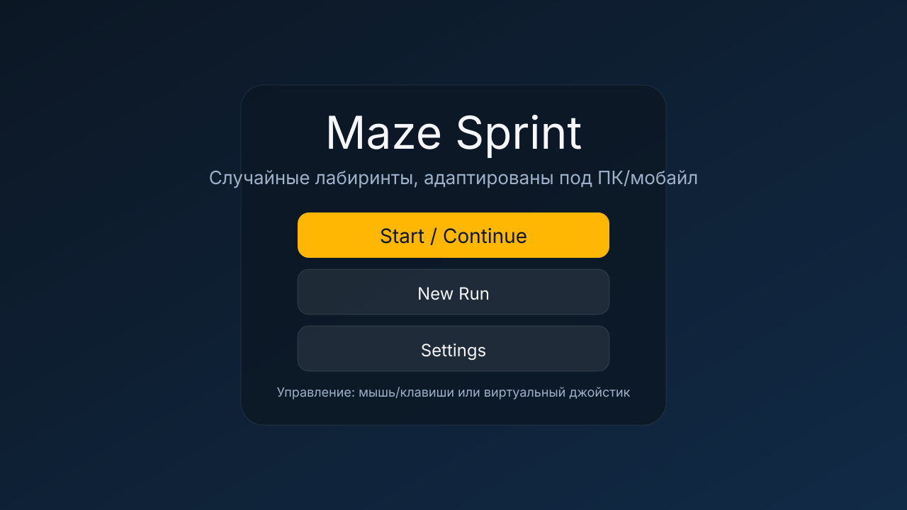
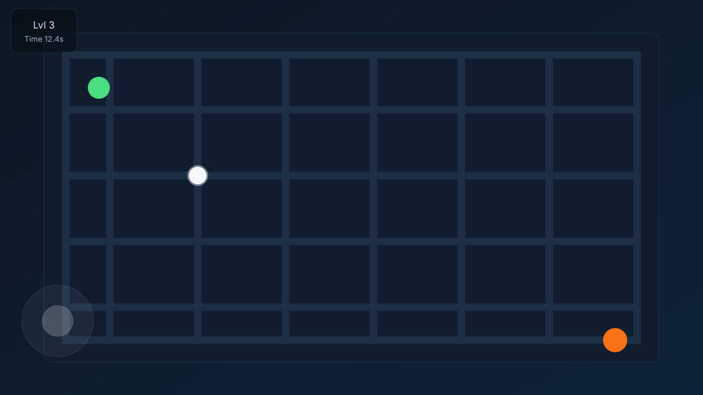

# Maze Sprint
Легковесная web-игра на TypeScript + Vite + Canvas: случайные «идеальные» лабиринты с ростом сложности, офлайн (localStorage), управление мышью/клавишами/виртуальным джойстиком, адаптив под мобайл и десктоп.

## Скриншоты
- Меню: 
- В игре: 

## Особенности
- Генерация идеального лабиринта (DFS backtracker) с seed-детерминизмом (`?seed=123`).
- Рост сложности: ширина/высота, толщина стен, радиус игрока, скорость, вероятность петель.
- Управление: mouse-follow или drag, клавиатура (WASD/стрелки), виртуальный джойстик на тач-экранах.
- Коллизии с «скольжением» вдоль стен; виброотклик на столкновение (если поддерживается).
- Пауза (Esc/двойной тап), экран результатов, сохранение прогресса и рекордов в localStorage.
- Debug overlay (`?debug=1`): FPS, seed, размер сетки, позиция игрока, счётчик столкновений.

## Установка и запуск
```bash
npm install
npm run dev   # http://localhost:5173
npm run build # продакшн-сборка
npm test      # vitest unit-тесты
```
> Примечание: если требуется воспроизвести конкретный лабиринт, используйте `?seed=<число>` в URL; новый забег из меню «New Run» обновляет базовый seed.

## Управление
- **ПК**: мышь (следование), drag или WASD/стрелки. Esc — пауза.
- **Мобайл**: виртуальный джойстик (по умолчанию) или drag в Настройках. Двойной тап по экрану — пауза.
- Финиш — оранжевый кружок; старт — зелёный.

## Тест-план (чеклист)
- **Браузеры**: Chrome/Edge/Firefox/Safari (desktop), Chrome/Safari (mobile). Проверить отсутствие скролла/зума во время игры.
- **Устройства/ориентации**: 360×640, 414×896, ≥1280×720; смена ориентации/resize сохраняет прогресс и корректно рескейлит канвас/джойстик.
- **Ввод**: mouse-follow, drag, клавиатура, джойстик; быстрые свайпы; pointercancel/leave; двойной тап/ESC ставят паузу и снимаются корректно.
- **Геймплей**: старт/финиш достижимы; столкновения блокируют стены; нет «залипания» в углах; радиус финиша срабатывает; пауза/возврат сохраняют таймер/позицию.
- **Persistence**: перезагрузка страницы сохраняет уровень/лучшие времена/настройки; «New Run» сбрасывает прогресс и seed; `?seed` воспроизводит лабиринт.
- **Performance**: целевые 60 FPS с overlay; отсутствие лишних аллокаций в game loop; offscreen слой стен не перерисовывается без нужды.
- **Edge cases**: потеря фокуса вкладки → авто-пауза; смена ориентации во время игры; очень большие dt клатчатся; виброотклик не ломает управление.

## Структура
- `index.html` — корневой шаблон, слой канваса и UI.
- `src/style.css` — адаптивная стилистика, HUD, меню, джойстик, overlay.
- `src/core/` — RNG, генерация лабиринта, коллизии, ввод, debug overlay, localStorage.
- `src/game/game.ts` — игровой цикл, состояние уровней, рендеринг, HUD callbacks.
- `src/main.ts` — UI-обвязка: меню/настройки/результаты, пауза, подключение game loop.
- `tests/` — vitest: генерация лабиринта (связность/детерминизм), коллизии.

## Известные моменты
- Если `npm install` в среде с ограниченным интернетом зависает, перезапустите с `npm install --registry=https://registry.npmjs.org --no-progress` или повторите локально на вашей машине — зависимости лёгкие (Vite + TypeScript + Vitest).
