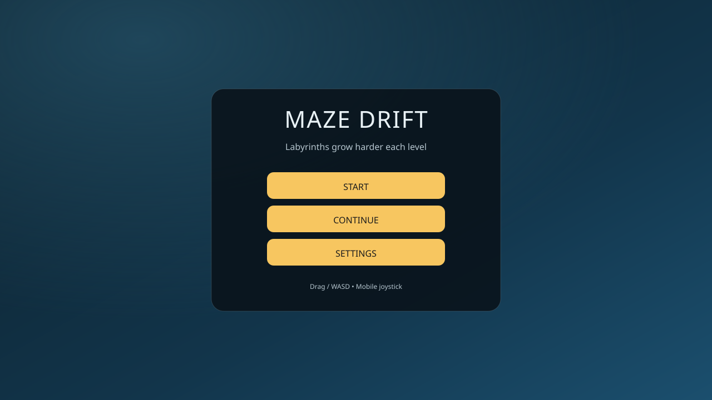
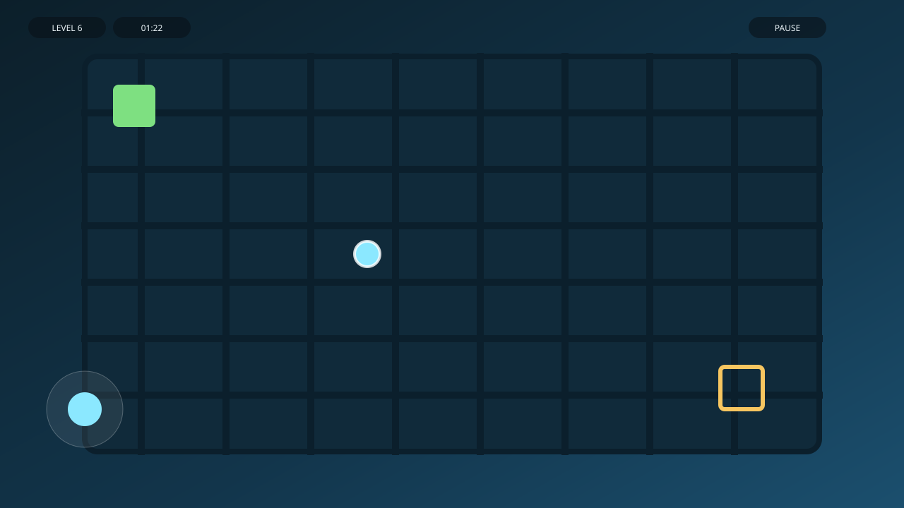
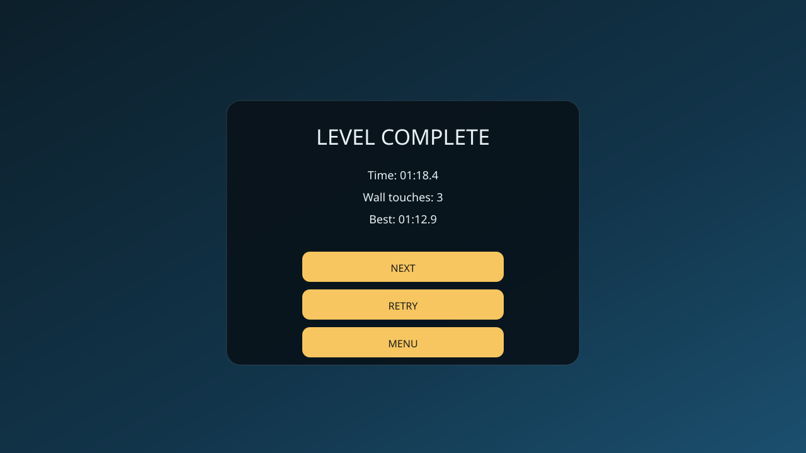

# Maze Drift

Полностью клиентская веб‑игра на Vite + TypeScript + Canvas. Генерация идеальных лабиринтов с ростом сложности по уровням.

## Скриншоты





## Запуск

```bash
npm install
npm run dev
```

Сборка и превью:

```bash
npm run build
npm run preview
```

Тесты:

```bash
npm run test
```

## Управление

- ПК: Drag мышью по канвасу или WASD / стрелки.
- Мобайл: виртуальный джойстик (по умолчанию) или Drag (переключается в Settings).
- Пауза: кнопка Pause, `Esc` или `P`.

## Debug overlay

Откройте с `?debug=1` или установите `localStorage['maze-debug']=1`.
