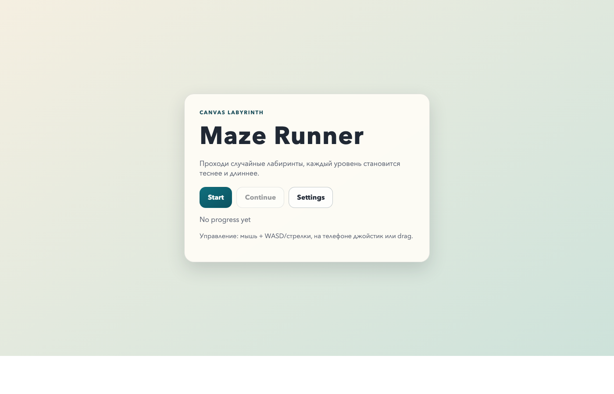
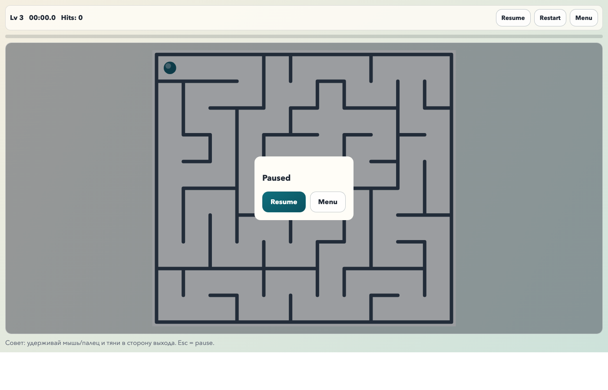
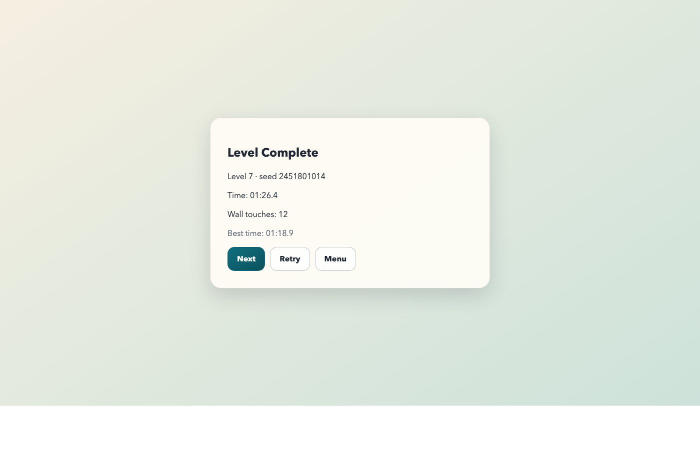

# Maze Runner (Vite + TypeScript + Canvas)

Клиентская веб-игра без бэкенда: случайно генерируемые лабиринты, усложнение по уровням, управление для ПК и мобильных, сохранение прогресса в `localStorage`.

## Стек

- `TypeScript`
- `Vite`
- `HTML/CSS`
- `Canvas 2D`
- `Vitest` (unit tests)

## Запуск

```bash
npm install
npm run dev
```

Сборка и тесты:

```bash
npm run test:run
npm run build
```

## Управление

- ПК:
  - удерживай мышь/тачпад и тяни в сторону движения
  - `WASD` или стрелки
- Мобайл:
  - джойстик (по умолчанию в `Auto` на touch-устройствах)
  - можно переключить на `Drag` в Settings
- Пауза: кнопка `Pause` или `Esc`
- Перезапуск уровня: `Restart`

## Скриншоты

### Главное меню



### Игровой процесс



### Экран результатов



## Debug overlay

- Включение в `Settings -> Debug Overlay`
- Или через URL: `?debug=1`

Показывает FPS, seed, размер сетки, позицию игрока, количество столкновений и текущий режим управления.

## Структура проекта

- `index.html` - точка входа
- `src/main.ts` - UI экраны, меню/результаты/настройки, связь с движком
- `src/style.css` - адаптивный интерфейс, mobile/desktop стили
- `src/game/engine.ts` - игровой цикл, состояние, уровни, завершение
- `src/game/maze.ts` - генерация лабиринта (DFS backtracker), проверка связности
- `src/game/rng.ts` - seedable RNG + seed hashing
- `src/game/level.ts` - прогрессия сложности по уровню
- `src/game/collision.ts` - коллизии, скольжение вдоль стен, анти-проход через стены
- `src/game/renderer.ts` - Canvas рендер + offscreen буфер + hiDPI
- `src/game/input.ts` - keyboard/mouse/touch/joystick ввод
- `src/game/storage.ts` - `localStorage` прогресс, best times, settings
- `src/game/audio.ts` - синтез простых звуков через WebAudio
- `src/game/debug.ts` - debug overlay
- `tests/maze.test.ts` - unit tests генератора
- `tests/collision.test.ts` - unit tests коллизий
- `QA_TEST_PLAN.md` - ручной чеклист QA
