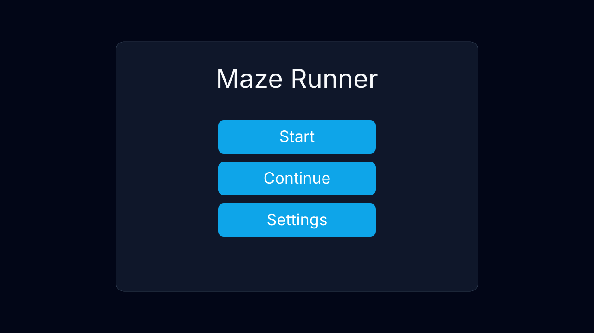
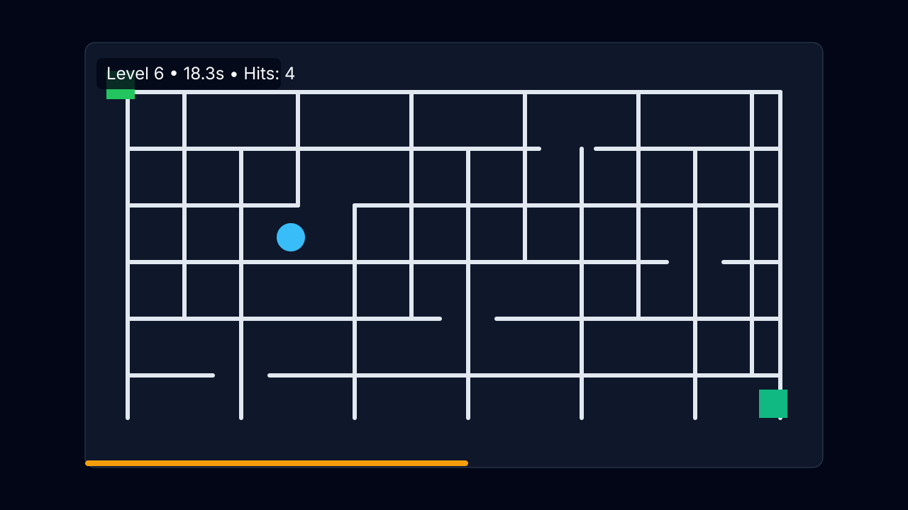
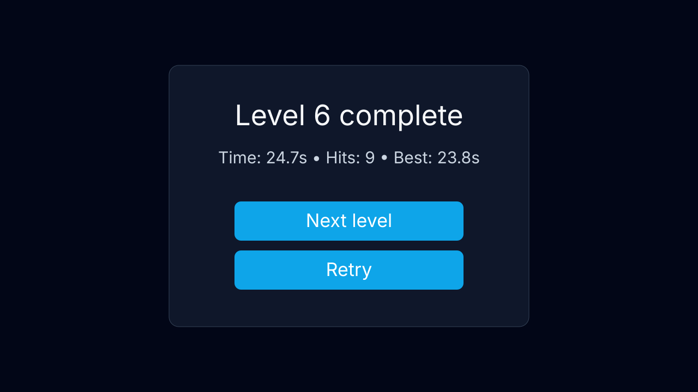

# Maze Runner (Vite + TypeScript + Canvas)

Клиентская игра-лабиринт без бэкенда: случайная генерация с seed, уровни сложности, управление на ПК/мобайле, сохранение прогресса в `localStorage`.

## Запуск

```bash
npm install
npm run dev
```

Дополнительно:

```bash
npm run test
npm run build
npm run preview
```

## Управление

- **ПК:**
  - мышь: ведите курсор (follow) или зажимайте ЛКМ и drag;
  - клавиатура: `WASD` / стрелки.
- **Мобайл:**
  - `Drag` или `Virtual Joystick` (в Settings).
- **Пауза/рестарт:** кнопки `Pause/Restart` в HUD.

## Скриншоты

### Меню


### Игровой процесс


### Экран результатов


## Что реализовано

- Генерация лабиринтов DFS backtracker (`perfect maze`), опциональные петли/комнаты на высоких уровнях.
- Детерминированность по seed: `sessionSeedBase + level`.
- Рост сложности: увеличивается сетка, уменьшается относительная ширина коридоров, растёт целевая длина пути.
- Коллизии по кругу с осевым разрешением (скольжение вдоль стен), anti-tunneling через пошаговое движение.
- Экран результата (время, столкновения, лучший результат), Next/Retry.
- Меню: Start / Continue / Settings (звук, вибрация, режим управления, debug overlay).
- Debug overlay: FPS, seed, размер сетки, позиция игрока, число столкновений.

## QA чеклист (ПК + мобайл)

1. **Функциональность**
   - Start/Continue/Settings открываются и работают.
   - Level complete показывает время/столкновения/Best, Next и Retry корректны.
   - Прогресс и best-time сохраняются после перезагрузки.
2. **Генерация лабиринтов**
   - Каждый новый уровень проходим.
   - Seed одного уровня воспроизводит один и тот же лабиринт внутри сессии.
   - На высоких уровнях сетка заметно больше и сложнее.
3. **Ввод (Desktop)**
   - Мышь follow/drag двигает игрока без прыжков.
   - WASD и стрелки работают одновременно с mouse.
   - Фокус-стили кнопок видимы с клавиатуры.
4. **Ввод (Mobile)**
   - Drag и Joystick отзывчивы, нет конфликта со скроллом во время игры.
   - Быстрые свайпы не пробивают стены.
   - Vibration вызывается при столкновениях (если поддерживается).
5. **Edge cases**
   - Потеря фокуса/сворачивание вкладки ставит игру на паузу.
   - Resize/смена ориентации не ломают игру.
   - Debug overlay корректно включается/выключается.
6. **Кросс-браузер**
   - Chrome, Firefox, Safari (desktop).
   - Chrome Android, Safari iOS.
7. **Производительность**
   - Удержание около 60 FPS на среднем телефоне.
   - Отсутствие заметных лагов при движении и при генерации уровня.

## Структура

- `src/core/*` — RNG, уровень, генерация и валидация лабиринта.
- `src/engine/*` — игровой цикл, коллизии, рендер.
- `src/input/*` — keyboard/pointer/joystick.
- `src/ui/*` — DOM и localStorage.
- `src/tests/*` — unit-тесты.
