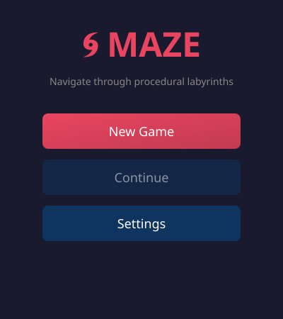
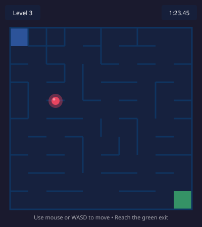
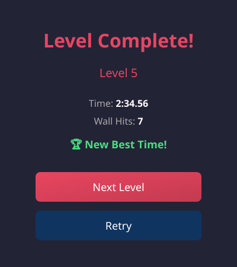
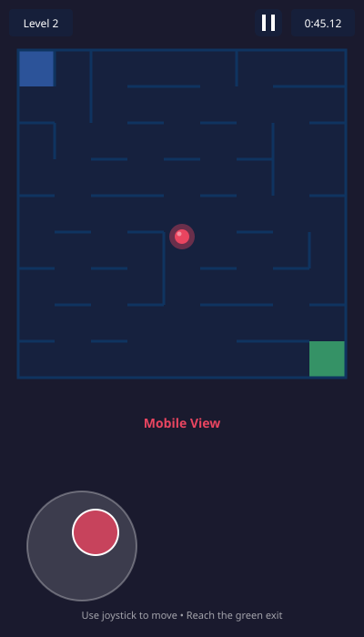

# Maze Game

A fully client-side web game where you navigate procedurally generated mazes that increase in difficulty with each level.

## Screenshots

<p align="center">
  
  
</p>

<p align="center">
  
  
</p>

## Features

- **Procedural Maze Generation**: Unique mazes generated using DFS backtracker algorithm
- **Progressive Difficulty**: Mazes grow larger and more complex with each level
- **Multiple Control Schemes**:
  - Keyboard: WASD or Arrow keys
  - Mouse: Player follows cursor
  - Touch: Virtual joystick (mobile)
- **Performance Optimized**: Offscreen canvas rendering, 60 FPS target
- **Progress Saving**: Level progress and best times saved to localStorage
- **Mobile Friendly**: Responsive layout, touch controls, vibration feedback
- **Debug Mode**: Press F3 to see FPS, position, collision count, and maze seed

## Controls

### Desktop
- **WASD** or **Arrow Keys**: Move player
- **Mouse**: Move cursor over canvas, player follows
- **ESC**: Pause game
- **F3**: Toggle debug overlay

### Mobile
- **Virtual Joystick**: Drag the joystick in the bottom-left corner
- **Pause Button**: Tap the pause icon in the top-right

## Getting Started

### Prerequisites
- Node.js 18+
- npm

### Installation

```bash
# Install dependencies
npm install

# Start development server
npm run dev
```

Open http://localhost:5173 in your browser.

### Build for Production

```bash
npm run build
```

Output will be in the `dist/` folder.

### Run Tests

```bash
# Run tests once
npm run test

# Run tests in watch mode
npm run test:watch
```

## Project Structure

```
src/
├── main.ts              # Entry point
├── game/
│   ├── Game.ts          # Main game controller
│   ├── Player.ts        # Player entity
│   └── Collision.ts     # Collision detection
├── maze/
│   ├── MazeGenerator.ts # DFS maze generation
│   └── RNG.ts           # Seedable random generator
├── input/
│   └── InputManager.ts  # Unified input handling
├── render/
│   ├── MazeRenderer.ts  # Offscreen maze rendering
│   └── PlayerRenderer.ts # Player drawing
├── storage/
│   └── Storage.ts       # localStorage wrapper
├── debug/
│   └── DebugOverlay.ts  # Debug info display
└── utils/
    ├── types.ts         # TypeScript types
    └── constants.ts     # Game constants
```

## Gameplay

1. **Start**: Navigate your red ball from the top-left corner
2. **Goal**: Reach the green exit zone in the bottom-right
3. **Obstacles**: Walls block your path - you must find the correct route
4. **Progress**: Each level gets progressively harder with larger mazes
5. **Score**: Try to complete levels quickly with fewer wall collisions

## Technical Details

- **Stack**: TypeScript, Vite, Canvas 2D API
- **No external runtime dependencies**
- **Seedable RNG** for reproducible mazes
- **Perfect maze algorithm** guaranteeing exactly one solution
- **Efficient collision detection** using spatial queries
- **HiDPI canvas** for sharp rendering on Retina displays

## License

MIT
