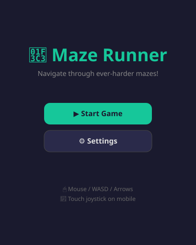
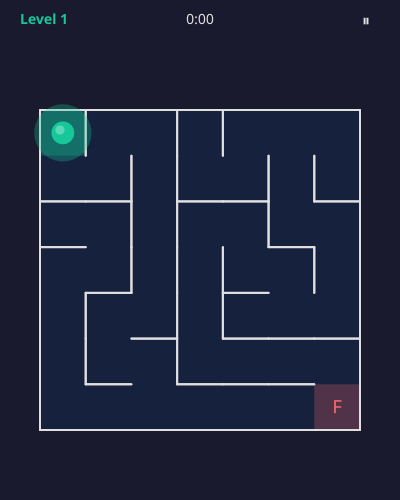
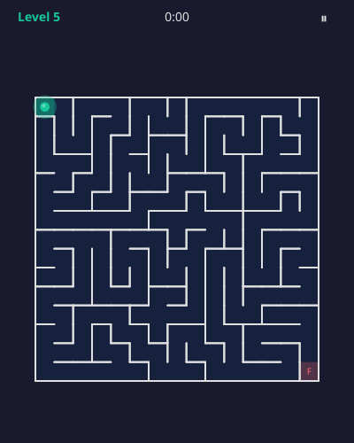
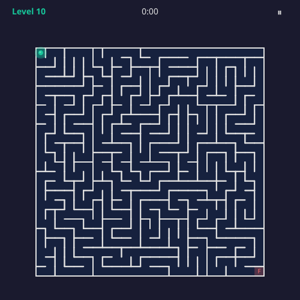
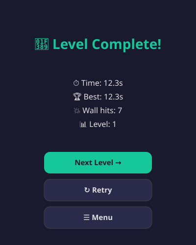

# 🏃 Maze Runner

A fully client-side maze game built with TypeScript + Vite + Canvas. No backend required.

## Screenshots

| Main Menu | Level 1 | Level 5 | Level 10 | Results |
|:---------:|:-------:|:-------:|:--------:|:-------:|
|  |  |  |  |  |

## Quick Start

```bash
npm install
npm run dev      # Dev server at http://localhost:5173
npm run build    # Production build → dist/
npm run test     # Run unit tests
```

## Gameplay

Navigate your ball from **S** (start, top-left) to **F** (finish, bottom-right).
Mazes are randomly generated and get harder each level (bigger grid, longer solution path).

## Controls

| Platform | Control | How |
|----------|---------|-----|
| Desktop | Mouse | Click & drag — ball follows cursor |
| Desktop | Keyboard | WASD or Arrow keys |
| Mobile | Touch | Virtual joystick (tap & drag bottom area) |
| Both | Pause | Esc key or ⏸ button |

## Features

- **Procedural maze generation** — DFS backtracker, seeded PRNG (deterministic per level)
- **Progressive difficulty** — grid size grows, solution path lengthens
- **Wall collision physics** — circle-vs-AABB with sliding
- **Dual input** — mouse follow + keyboard + virtual joystick
- **HiDPI / Retina** — canvas scaled to devicePixelRatio
- **Sound effects** — procedural Web Audio (no assets)
- **Haptic feedback** — vibration on wall hits (mobile)
- **Save progress** — localStorage (level + best times)
- **Debug overlay** — FPS, seed, grid size, position (toggle in Settings)
- **Responsive** — works on 360×640 phones to wide desktop

## Settings

Open Settings from the main menu to toggle:
- Sound effects
- Vibration (mobile)
- Control mode (Auto / Mouse / Keyboard / Joystick)
- Debug overlay

## Architecture

```
src/
  main.ts              — App entry, UI controller
  types.ts             — Shared TypeScript types
  storage.ts           — localStorage wrapper
  audio.ts             — Procedural Web Audio sounds
  game/
    engine.ts          — Game loop, state machine
    maze.ts            — Maze generator (DFS backtracker)
    collision.ts       — Wall collision detection
    levels.ts          — Level difficulty config
  input/
    manager.ts         — Unified input (keyboard/mouse/joystick)
  render/
    renderer.ts        — Canvas rendering (offscreen maze + player)
tests/
  maze.test.ts         — Maze connectivity, determinism, boundaries
  collision.test.ts    — Collision resolution correctness
  rng.test.ts          — PRNG determinism and distribution
```

## Test Plan (QA Checklist)

### Functional
- [ ] Maze is fully connected (every cell reachable) — **unit tested**
- [ ] Start → Finish always solvable — **unit tested**
- [ ] Same level = same maze (deterministic seed) — **unit tested**
- [ ] Outer walls intact — **unit tested**
- [ ] Player cannot walk through walls — **unit tested**
- [ ] Collision sliding works (not sticky)
- [ ] Level completes when reaching finish cell
- [ ] Timer runs during play, pauses correctly
- [ ] Wall hit counter increments
- [ ] Next level is larger than previous
- [ ] Progress saved to localStorage
- [ ] Best time tracked per level

### Input
- [ ] WASD movement works
- [ ] Arrow keys work
- [ ] Mouse click+drag: ball follows cursor
- [ ] Touch joystick appears on mobile
- [ ] Joystick drag controls movement
- [ ] No scroll/zoom during gameplay
- [ ] Esc pauses game
- [ ] Tab-out pauses game (visibility change)

### Cross-platform
- [ ] Chrome desktop
- [ ] Firefox desktop
- [ ] Safari desktop
- [ ] Chrome Android
- [ ] Safari iOS
- [ ] Portrait orientation (phone)
- [ ] Landscape orientation (phone)
- [ ] Orientation change during play
- [ ] Window resize during play

### Performance
- [ ] 60 FPS on mid-range phone (level 1-10)
- [ ] Maze renders once to offscreen buffer
- [ ] No layout thrashing in game loop
- [ ] No GC pauses from allocations in loop

### Edge Cases
- [ ] Very fast swipe doesn't teleport through walls
- [ ] Tab out & back: time doesn't jump
- [ ] localStorage full/unavailable: no crash
- [ ] Extremely large maze (level 20+) still playable
